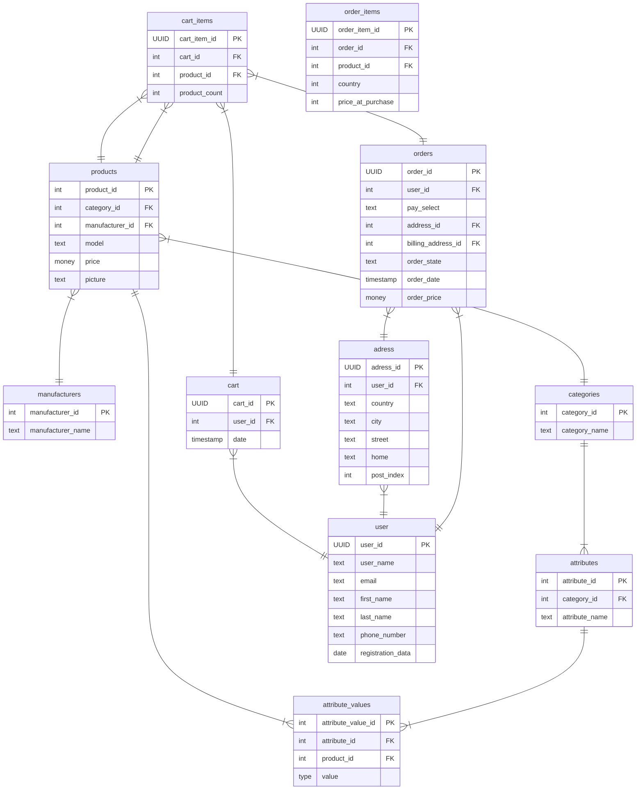

      

      
      
      
      
      
       

## About

🌐 Web configurator for building a gaming PC with testing.
## Documentation
ERD:

    
## External resources

      
<b>NPM</b>

      

    <ul>
        <li>ReactiveSearch [npm install @appbaseio/reactivesearch]</li>
        <li>Font Awesome [npm i --save @fortawesome/fontawesome-svg-core]</li>            
    </ul>

      
<b>NuGet</b>

      

    <ul>
          <li>Entity Framework Core</li>
          <li>Npgsql.EntityFrameworkCore.PostgreSQL</li>
          <li>Serilog</li>
          <li>AutoMapper</li>
    </ul>

## Developers

- [Ryzhakov](https://github.com/pavel-ryzhakov)
- [Fenix](https://github.com/Fenix-NET)

## License
